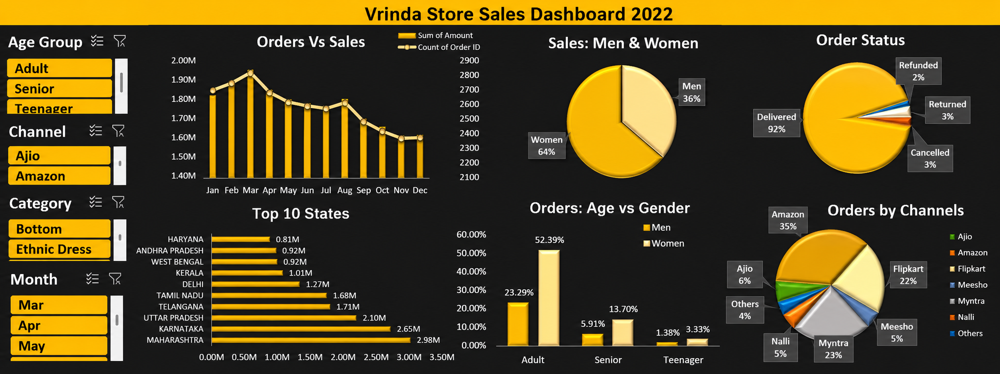

<h1 align="center">
Vrinda Store Sales Analysis
</h1>


<p align="center">
  
  
  
  
</p>


<p align="center">
Built using <b>Microsoft Excel</b> to analyze <b>Vrinda Store's 2022 sales performance</b> and transform raw transactional data into <b>actionable business insights</b>.
</p>

---

# 📊 Dashboard Preview

<p align="center">

</p>

---

# 📌 Project Summary

Vrinda Store is an Indian fashion retailer selling products across multiple e-commerce platforms including **Amazon, Flipkart, Myntra, Ajio, Meesho, and Nalli**.

This project analyzes **one year of sales data** to uncover **customer purchasing behaviour**, **regional performance**, **sales trends**, and **channel effectiveness**. Using **Microsoft Excel**, raw transactional data was transformed into an **interactive dashboard** that enables stakeholders to monitor business performance and support **data-driven decision-making**.

---

# 🎯 Business Requirements

The dashboard was developed to answer the following business questions:

- Which month generated the **highest sales** and **order volume**?
- Which **customer segment** contributes the highest revenue?
- Which **states** generate the highest sales?
- Which **sales channels** perform the best?
- What is the overall **order fulfillment status**?
- How do **customer age and gender** influence purchasing behaviour?
- Which **product categories** contribute the most to business performance?

---

# 📈 Key Business Insights

| Business Area | Insight |
|---------------|---------|
| 📅 Sales Trend | **March** recorded the highest sales and order volume. |
| 👩 Customer Segment | **Women contributed approximately 64%** of total sales. |
| 🎯 Target Audience | **Adult women (30–49 years)** generated the highest number of orders. |
| 🏆 Top States | **Maharashtra, Karnataka, and Uttar Pradesh** emerged as the highest revenue-generating states. |
| 🛒 Sales Channels | **Amazon** was the leading sales channel, followed by **Myntra** and **Flipkart**. |
| 📦 Order Fulfillment | **More than 90%** of customer orders were successfully delivered. |

---

# 🖥 Dashboard Components

- Interactive Dashboard
- Monthly Sales & Orders Analysis
- Customer Demographics Analysis
- State-wise Sales Performance
- Sales Channel Analysis
- Order Status Distribution
- Category-wise Analysis
- Dynamic Slicers for Interactive Filtering

---

# ⚙️ Project Workflow

```text
Raw Sales Data
        │
        ▼
Data Cleaning
        │
        ▼
Data Processing
        │
        ▼
Pivot Tables & Pivot Charts
        │
        ▼
Interactive Dashboard
        │
        ▼
Business Insights & Recommendations
```

---

# 💼 Business Recommendation

Based on the analysis, **Vrinda Store should focus its marketing efforts on adult women aged 30–49 living in Maharashtra, Karnataka, and Uttar Pradesh through high-performing sales channels such as Amazon and Myntra.** This customer segment contributes the largest share of overall sales and represents the greatest opportunity for future revenue growth.

---

# 🛠 Tools & Skills

| Tool / Skill | Purpose |
|--------------|---------|
| Microsoft Excel | Data cleaning, analysis & dashboard development |
| Pivot Tables | Data summarization and aggregation |
| Pivot Charts | Business data visualization |
| Slicers | Interactive dashboard filtering |
| Data Cleaning | Preparing raw data for analysis |
| Dashboard Design | Interactive business reporting |
| Business Analysis | Converting data into actionable insights |

---

# 👤 Author

## **Aman Singh**


Data Analyst | Excel | SQL | Power BI | Python


[](https://www.linkedin.com/in/aman-singh-851434284)
[](https://github.com/iamsinghh)
